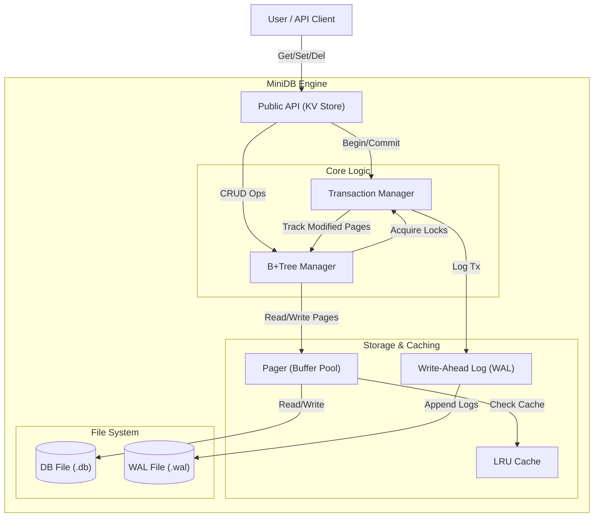
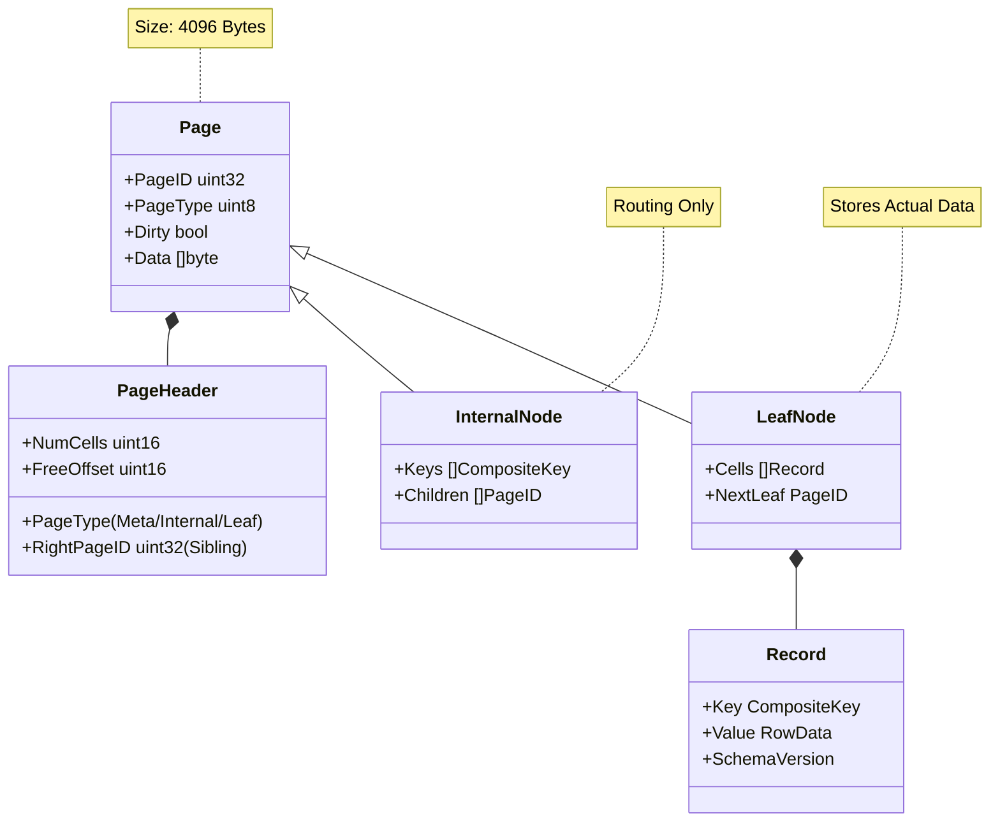
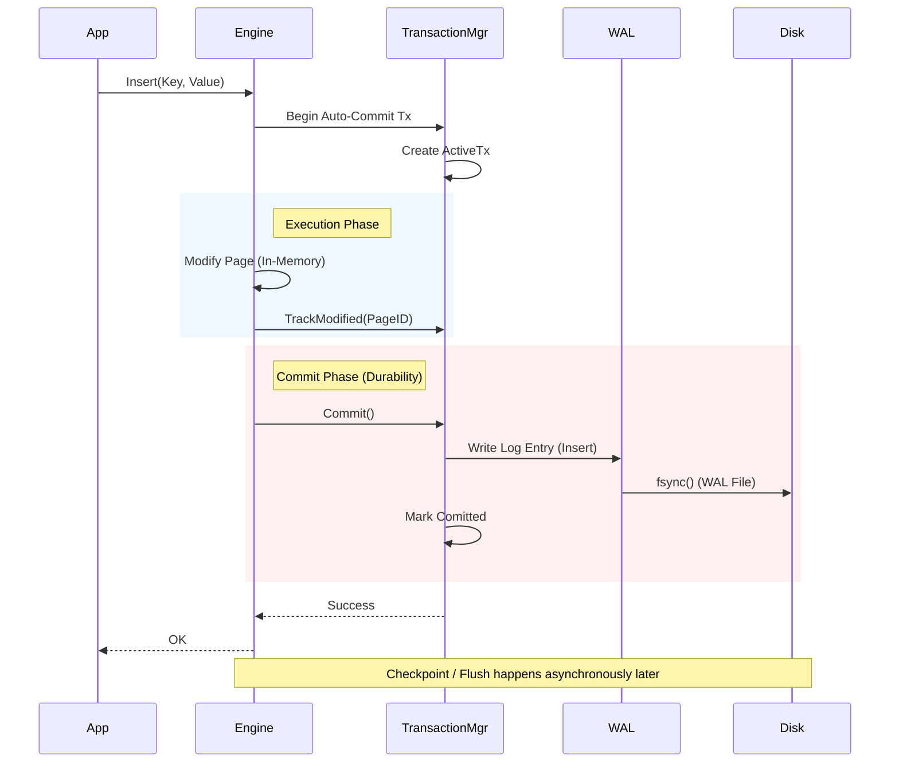
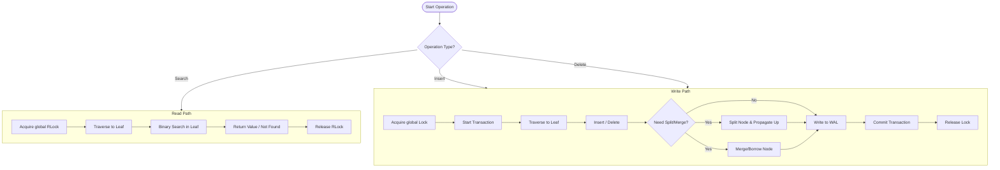

# MiniDB Architecture

This document provides a visual overview of the MiniDB architecture, illustrating the core components, data structures, concurrency model, and transaction flow.

## 1. High-Level System Architecture

MiniDB follows a layered architecture where the **B+Tree Engine** orchestrates operations between the high-level API and the low-level storage subsystems.



---

## 2. B+Tree & Data Structure Layout

MiniDB uses a page-based B+Tree structure. Every node is a 4KB page.



---

## 3. Concurrency Model (Phase 3.5)

The current concurrency model allows multiple concurrent readers but prioritizes correctness by serializing writers.

```mermaid
graph TD
    subgraph "Traffic"
        R1[Reader 1]
        R2[Reader 2]
        R3[Reader 3]
        W1[Writer 1]
        W2[Writer 2]
    end

    subgraph "Synchronization Layer"
        RLock["Global Read Lock (RLock)"]
        WLock["Global Write Lock (Lock)"]
    end

    subgraph "Execution"
        Engine["B+Tree Engine"]
    end

    R1 --> RLock
    R2 --> RLock
    R3 --> RLock
    
    W1 --> WLock
    W2 --> WLock
    
    RLock -.->|Concurrent Access| Engine
    WLock -->|Serialized Access| Engine
    
    note right of RLock: Non-Blocking for Readers
    note right of WLock: Blocking (1 Writer at a time)
```

**Locking Strategy:**
- **Readers**: Acquire `tree.mu.RLock()`.
- **Writers**: Acquire `tree.mu.Lock()`.
- **Transactions**: `TxManager` protects its internal state with fine-grained mutexes (`tm.mu`).

---

## 4. Transaction & WAL Lifecycle

Ensures ACID properties and crash safety.



---

## 5. Core Operations Flow

Common logic for standard B+Tree operations.


